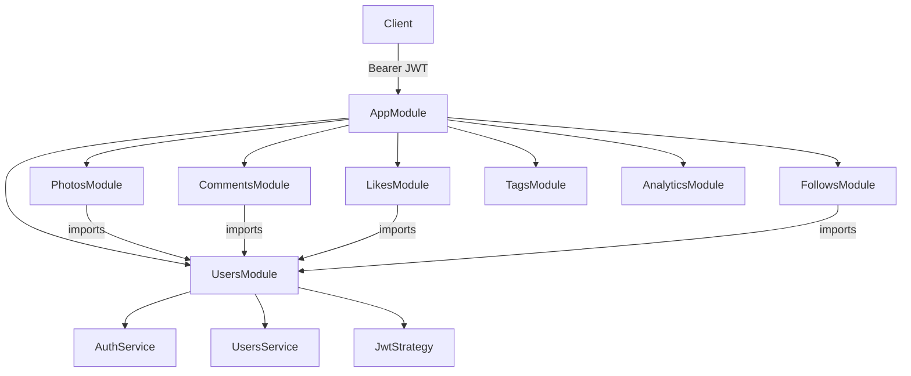
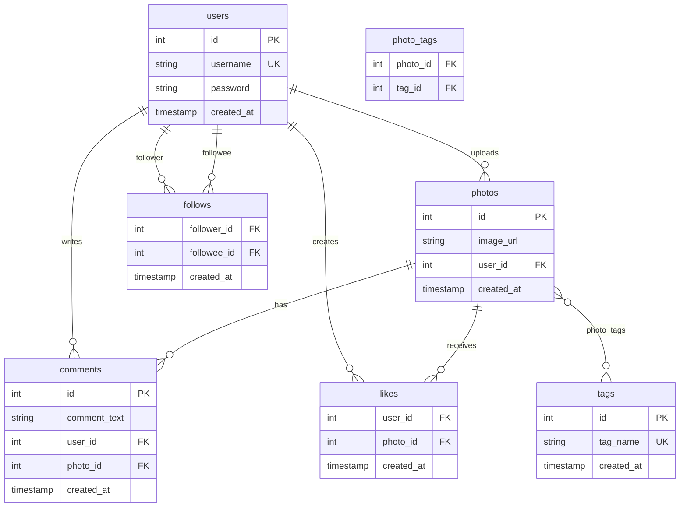
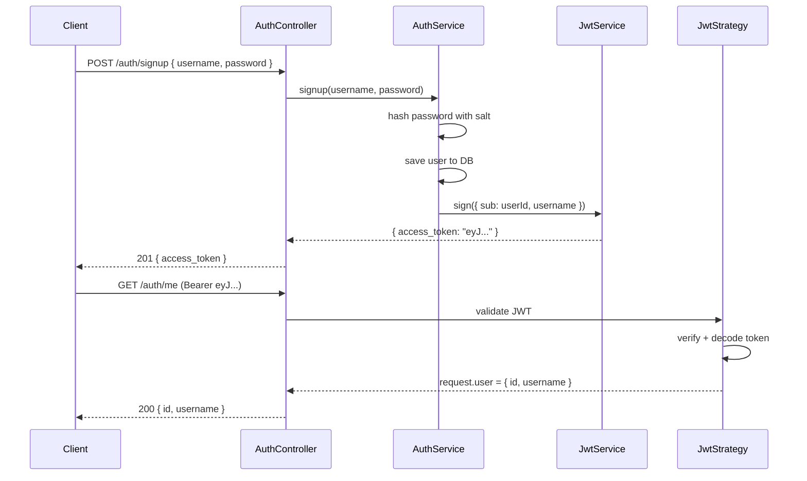
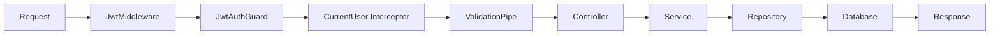

# Instagram API — NestJS Implementation Plan

## Target Output

A fully-deployed REST API at `instagram-api/` covering all 21 NestJS topic areas from [notes/nestjs-course-notes.md](notes/nestjs-course-notes.md).

---

## Architecture Overview

---

## Database Schema (7 Tables)

---

## JWT Auth Flow

---

## Request Lifecycle (Full)

---

## Phase Plan

### Phase 1 — Project Bootstrap

- `nest new instagram-api` with latest CLI
- Install: `@nestjs/typeorm typeorm sqlite3 @nestjs/jwt @nestjs/passport passport passport-jwt class-validator class-transformer bcrypt`
- Create `AppModule` with `TypeOrmModule.forRoot()` (SQLite dev config)
- Enforce file conventions: `name.type.ts` throughout

**Covers:** NestJS §1 (Intro), §2 (Project Structure)

---

### Phase 2 — Users Module + TypeORM Entities

- `User` entity with `@Entity`, `@PrimaryGeneratedColumn`, `@Column`, `@CreateDateColumn`
- `UsersService`: `create`, `findOne`, `find`, `update`, `remove`
- `UsersController`: full CRUD — `@Get`, `@Post`, `@Patch`, `@Delete`, `@Param`, `@Query`, `@Body`
- Register with `TypeOrmModule.forFeature([User])`

**Covers:** §3 (Request Handling), §5 (Services/Repositories), §11 (TypeORM Entities), §12 (Repository API)

---

### Phase 3 — Validation & DTOs

- `CreateUserDto`: `@IsString() @MinLength(3) username`, `@IsString() @MinLength(6) password`
- `UpdateUserDto`: extends `PartialType(CreateUserDto)` — all fields optional
- Global `ValidationPipe({ whitelist: true })`
- Throw `NotFoundException` if user not found, `BadRequestException` for duplicates

**Covers:** §4 (Validation & DTOs)

---

### Phase 4 — Dependency Injection Deep Dive

- Demonstrate Bad → Better → Best IoC pattern in `UsersService`
- Show DI Container registering classes at startup
- Use `@Injectable()` + `providers: [UsersService]` in `UsersModule`
- Create `FakeUsersRepository` class to illustrate swap-ability

**Covers:** §6 (DI), §7 (IoC), §9 (DI Container)

---

### Phase 5 — JWT Authentication

- Install `@nestjs/jwt`, `@nestjs/passport`, `passport-jwt`, `bcrypt`
- `AuthService`:
  - `signup(username, password)` — hash password with `bcrypt.hash(password + salt, 10)`, save user, return JWT
  - `signin(username, password)` — find user, verify hash, return JWT
- `JwtStrategy` extends `PassportStrategy(Strategy)`:
  - validates `{ sub: userId }` payload → returns user from DB
- `JwtAuthGuard` extends `AuthGuard('jwt')`:
  - use on any protected route
- `AuthController`: `POST /auth/signup`, `POST /auth/signin`, `GET /auth/me`
- `JwtModule.register({ secret: process.env.JWT_SECRET, signOptions: { expiresIn: '7d' } })`

Key difference from cookie-session in course notes: token is returned in response body and sent as `Authorization: Bearer <token>` header, not stored in a cookie.

**Covers:** §15 (Auth — Hashing), §16 (Guards)

---

### Phase 6 — Cross-Module DI + Module Exports

- `UsersModule` exports `UsersService` so `AuthModule` and other modules can inject it
- `PhotosModule` imports `UsersModule` to associate photos with users
- Demonstrate DI Container per module — not global
- Show `imports: [UsersModule]` pattern

**Covers:** §19 (Modules & Cross-Module DI), §20 (Advanced DI)

---

### Phase 7 — Custom Decorators & Interceptors (CurrentUser)

- `@CurrentUser()` param decorator reads `request.user` (set by `JwtStrategy`)
- `CurrentUserInterceptor` — optional global interceptor to attach full User entity to request
- Apply `@UseGuards(JwtAuthGuard)` + `@CurrentUser()` on protected controllers
- Different response DTOs per route via `@Serialize(Dto)` custom decorator

**Covers:** §14 (Interceptors & Serialization)

---

### Phase 8 — Photos Module

- `Photo` entity: `id`, `image_url`, `created_at`, `@ManyToOne(() => User)` user
- `User` entity: add `@OneToMany(() => Photo)` photos
- Routes: `POST /photos`, `GET /photos/:id`, `DELETE /photos/:id`, `GET /users/:id/photos`
- Ownership check on delete: `if (photo.user.id !== currentUser.id) throw ForbiddenException`
- Relations not auto-fetched — use `relations: ['user']` explicitly

**Covers:** §11, §12, §13 (OneToMany/ManyToOne)

---

### Phase 9 — Comments Module

- `Comment` entity: `id`, `comment_text`, `created_at`, `@ManyToOne User`, `@ManyToOne Photo`
- Triangle relationship: User ↔ Comment ↔ Photo
- Routes: `POST /photos/:id/comments`, `GET /photos/:id/comments`, `DELETE /comments/:id`
- QueryBuilder to sort comments by `created_at ASC`

**Covers:** §13 (multi-table relations, QueryBuilder basics)

---

### Phase 10 — Likes Module (Composite Primary Key)

- `Like` entity: `@PrimaryColumn() user_id`, `@PrimaryColumn() photo_id`, `created_at`
- No auto-increment ID — composite key prevents duplicate likes
- Handle unique constraint violation → `ConflictException`
- Routes: `POST /photos/:id/likes`, `DELETE /photos/:id/likes`

**Covers:** §13 (Many-to-Many, composite keys)

---

### Phase 11 — Follows Module (Self-Referential)

- `Follow` entity: `@PrimaryColumn() follower_id`, `@PrimaryColumn() followee_id`, `created_at`
- `User` entity: `@OneToMany` following + followers (two relations to same table)
- Guard: prevent following yourself
- Routes: `POST /follows/:userId`, `DELETE /follows/:userId`, `GET /users/:id/followers`, `GET /users/:id/following`
- Feed query with QueryBuilder join on follows table

**Covers:** §13 (self-referential Many-to-Many, complex QueryBuilder)

---

### Phase 12 — Tags Module (Three-Table Design)

- `Tag` entity: `id`, `tag_name` (unique), `@ManyToMany(() => Photo)` photos
- `Photo` entity: add `@ManyToMany(() => Tag)` tags + `@JoinTable()`
- Find-or-create tag pattern (upsert)
- Routes: `POST /photos/:id/tags`, `GET /tags/:name/photos`, `GET /tags/trending`
- Trending query: count photo_tags per tag, order DESC, limit 5

**Covers:** §13 (ManyToMany with junction table)

---

### Phase 13 — Response Serialization

- `UserDto`: expose `id`, `username` — hide `password`
- `PhotoDto`: expose `id`, `image_url`, `created_at`, `username` (from joined user)
- `UserProfileDto`: expose `id`, `username`, `photo_count`, `follower_count`
- Custom `SerializeInterceptor` + `@Serialize(Dto)` decorator pattern
- Apply per-handler for admin vs public responses

**Covers:** §14 (Interceptors & Serialization, custom decorators)

---

### Phase 14 — Analytics Module (QueryBuilder Mastery)

All 7 SQL challenges from [notes/instagram-database-clone/instagram-database-clone.md](notes/instagram-database-clone/instagram-database-clone.md) as API endpoints:

- `GET /analytics/oldest-users` — 5 oldest accounts
- `GET /analytics/popular-signup-day` — most popular registration day
- `GET /analytics/inactive-users` — users who never posted
- `GET /analytics/most-liked-photo` — contest winner
- `GET /analytics/avg-posts-per-user` — investor metric
- `GET /analytics/top-hashtags` — top 5 tags
- `GET /analytics/bot-accounts` — users who liked every photo

**Covers:** §13 (QueryBuilder: `.where`, `.having`, `.groupBy`, `.orderBy`, `.getRawMany`, subqueries)

---

### Phase 15 — Unit & E2E Testing

- Unit tests for `AuthService` using `FakeUsersService` (no DB)
- E2E tests for full signup/signin/protected-route flow using `supertest`
- Isolated `test.sqlite` database per test run
- Move `ValidationPipe` into `AppModule` so E2E tests pick it up

**Covers:** §17 (Unit Testing, E2E Testing, Jest mocks, isolated test DB)

---

### Phase 16 — Configuration & Environments

- `.env` (dev), `.env.test` (test), production uses real env vars
- `ConfigModule.forRoot({ envFilePath: ['.env'] })`
- `ConfigService` injected into `TypeOrmModule.forRootAsync()`
- `JWT_SECRET`, `DB_NAME`, `NODE_ENV` as env vars
- `synchronize: true` only in dev/test — `false` in production

**Covers:** §18 (Config & Environments)

---

### Phase 17 — Migrations & Deployment

- Add `ormconfig.js` for TypeORM CLI (separate from Nest app)
- Generate migrations for all 7 tables: `typeorm migration:generate`
- `up()` creates tables, `down()` drops them
- Switch `AppModule` to `synchronize: false` + `migrations: [...]`
- Deploy to Railway/Heroku with PostgreSQL
- Run `typeorm migration:run` on deploy

**Covers:** §21 (Migrations, Deployment, production DB)

---

## Key Files to Create

- `src/app.module.ts` — root module, TypeORM config, ConfigModule
- `src/users/user.entity.ts` — User entity
- `src/users/users.module.ts` — exports UsersService
- `src/users/users.service.ts` — CRUD
- `src/auth/auth.module.ts` — imports JwtModule, UsersModule
- `src/auth/auth.service.ts` — signup/signin with bcrypt + JWT
- `src/auth/jwt.strategy.ts` — PassportStrategy to validate Bearer tokens
- `src/auth/jwt-auth.guard.ts` — extends AuthGuard('jwt')
- `src/auth/decorators/current-user.decorator.ts`
- `src/photos/photo.entity.ts`
- `src/comments/comment.entity.ts`
- `src/likes/like.entity.ts` — composite PK
- `src/follows/follow.entity.ts` — composite PK, self-referential
- `src/tags/tag.entity.ts` — ManyToMany with Photo
- `src/analytics/analytics.controller.ts` — all 7 query endpoints
- `src/interceptors/serialize.interceptor.ts`
- `migrations/` — all table migrations
- `.env`, `.env.test`
- `test/auth.e2e-spec.ts`
